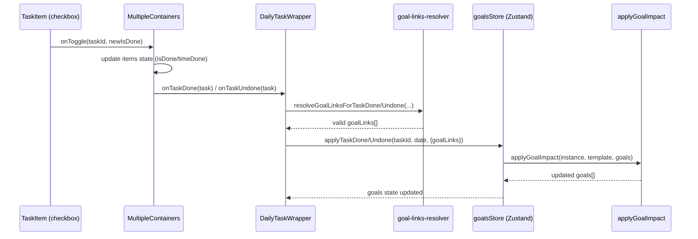

# Архітектура та потік даних

Цей документ описує, **звідки беруться дані**, **де зберігається стан**, і **як проходить потік подій** у застосунку.

## Технологічний стек (в контексті архітектури)

- **UI**: React + TypeScript + Tailwind
- **Drag & Drop / списки**: `@dnd-kit/*`
- **Стан**:
  - **Goals**: Zustand store з persist у `localStorage` (ключ `chrono-goals`)
  - **Tasks (template/daily/planned)**: Firebase Firestore (через сервіси у `src/services/firebase/`)
- **Локалізація**: i18next

## Джерела правди (source of truth)

- **Шаблон задач**: Firestore → колекція `template-tasks`
- **Щоденні задачі**: Firestore → колекція `daily-tasks` (документ на день)
- **Заплановані задачі (timeline/preset)**: Firestore → `planned-tasks`
- **Цілі (Goals)**: **Zustand + localStorage** (не Firebase)

> Важливо: якщо в UI “бачиш старі цілі”, це зазвичай означає, що в `localStorage` залишився попередній state (`chrono-goals`).

## Основні сутності (спрощено)

- **Task (ItemTask)**: `id`, `title`, `isDone`, `time`, `timeDone`, `goalLinks?`, `schedule?`, …
- **Goal**: `id`, `title`, `metric { type, target }`, `progress`, `status`
- **TaskGoalLink**: `{ goalId, impact }` — описує, як задача впливає на прогрес цілі.

## Потік подій: check / uncheck задачі

Нижче описано шлях від кліку по чекбоксу до оновлення прогресу цілі.

### 1) Клік по чекбоксу

- **Файл**: `src/components/dnd/task-item.tsx`
- **Подія**: `onChange` чекбоксу викликає `onToggle(task.id, !task.isDone)`

### 2) Оновлення задачі в списку та виклик колбеків done/undone

- **Файл**: `src/components/dnd/multiple-container.tsx`
- **Функція**: `handleToggleTask(taskId, newIsDone)`

Що відбувається:

- оновлюється `isDone` (і за потреби `timeDone`)
- викликається `onChangeTasks(updated)` (persist у Firestore робиться вище по дереву)
- викликається **один із колбеків**:
  - `onTaskDone(doneTask)`
  - `onTaskUndone(undoneTask)`

### 3) Резолв `goalLinks` для задачі (бізнес-логіка)

- **Файл**: `src/pages/daily-components/daily-task-wrapper.tsx`
- **Сервіс**: `src/services/task-menager/task-goal-links-resolver.ts`

На події done/undone wrapper:

- збирає “актуальні” лінки задачі до цілей через сервіс:
  - `resolveGoalLinksForTaskDone(...)`
  - `resolveGoalLinksForTaskUndone(...)`
- якщо лінки знайдені → викликає:
  - `useGoalsStore().applyTaskDone(...)`
  - `useGoalsStore().applyTaskUndone(...)`

#### Як саме сервіс знаходить `goalLinks`

`task-goal-links-resolver.ts` використовує кілька джерел у порядку пріоритету:

1. **`lastEnrichedItems`** (збагачений список дня — якщо там уже є `goalLinks`)
2. **`task.goalLinks`** (якщо лінки збережені в daily record)
3. **Шаблон**: `getGoalLinksFromTemplate(task.id, task.title, templateItems)`
4. **Fallback по шаблону**: `getGoalLinksFromGoalsFallback(...)`
5. **Semantic fallback**: `getSemanticGoalLinks(...)` (для простих “зробити 1 раз”)

Далі сервіс:

- **очищає** лінки на неіснуючі цілі (застарілі `goalId`)
- **відбирає** тільки ті цілі, які можна оновлювати за статусом (active/paused/…)

### 4) Застосування впливу на прогрес цілей

- **Store**: `src/storage/goalsStore.ts`
  - `applyTaskDone(...)`
  - `applyTaskUndone(...)`
- **Обчислення**: `src/services/task-menager/apply-goal-impact.ts`
  - `applyGoalImpact(instance, template, goals)`

`applyTaskDone/Undone` формує:

- `TaskInstance` (status = done/todo)
- `TaskTemplate` (містить `goalLinks`)

Потім `applyGoalImpact`:

- знаходить goal за `goalId`
- рахує `delta` з `impact` (count/minutes/…)
- оновлює `goal.progress`

## Потік даних: шаблон → день

### Template

- **Сторінка**: `src/pages/TemplateTask.tsx`
- **Збереження**: `saveTemplateTasks(items)` → `src/services/firebase/taskManagerData.ts`

### Daily

- **Сторінка**: `src/pages/daily-components/daily-task-wrapper.tsx`
- **Завантаження**:
  - `loadDailyTasksByDate(date, dailyTasks)` (FireStore)
  - `loadTemplateTasks()` (FireStore)
- **Збереження**: `saveDailyTasks(items, date, dailyTasks)` (FireStore)

## Відомі “гострі кути”

### 1) Застарілі `goalId` після видалення/пересоздання цілі

Сценарій:

- була Goal A → задача в day D має `goalLinks` на A
- Goal A видалили / створили Goal B
- day D все ще містить `goalLinks` на A → прогрес не оновлюється

Рішення в коді:

- резолвер очищає лінки на неіснуючі цілі і підтягує актуальні з шаблону.

### 2) Дублікати “однакових” цілей

Якщо є кілька goals з однаковою назвою, UI може виглядати як “та сама ціль”, але `id` різні — важливо дебажити по `goal.id`.

### 3) Persist цілей у localStorage

Цілі не приходять з Firebase. Якщо стан виглядає “зламаним”:

- DevTools → Application → Local Storage → **`chrono-goals`** → видалити → reload.

## Діаграма (check → progress)

